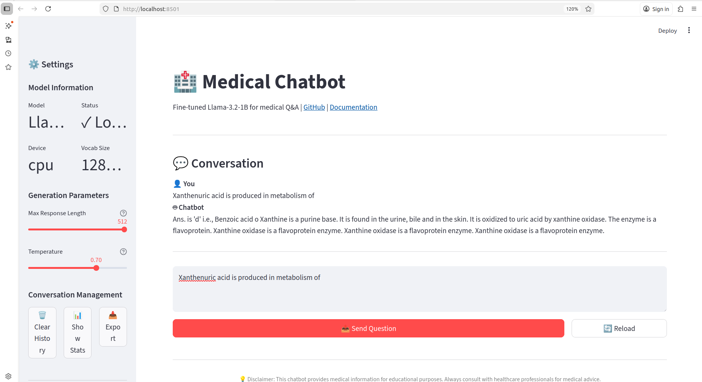

# 🏥 Medical Chatbot - Fine-Tuned Llama-3.2-1B

A production-ready medical chatbot powered by **Llama-3.2-1B** fine-tuned using **QLoRA** on 193K medical Q&A samples. Provides three interfaces: **CLI**, **Web UI**, and **REST API**.

## ⚡ Quick Start (30 seconds)

```bash
# 1. Install dependencies
pip install -r requirements.txt

# 2. Merge model (one-time setup)
python src/model_merger.py

# 3. Run your preferred interface
python run_cli.py              # CLI mode
streamlit run run_web.py       # Web UI
python run_api.py              # REST API
```

## 🌟 Features

✅ **Three Interface Options**
- 🖥️ **CLI** - Interactive terminal chat
- 🌐 **Web UI** - Beautiful Streamlit interface
- 🔌 **REST API** - Programmatic access via HTTP

✅ **Advanced Capabilities**
- Conversation history and context management
- Session persistence
- Export conversations (TXT/JSON)
- Configurable generation parameters
- Batch processing support

✅ **Medical Knowledge**
- Fine-tuned on 193K medical Q&A samples
- Covers 10+ medical specialties
- Fast inference (QLoRA optimization)
- Efficient 4-bit quantization

## 🖼️ UI Preview

<div align="center">



*Medical Chatbot Streamlit Interface - Settings panel with model information, conversation interface, and configurable generation parameters*

</div>

## 📊 Model Specifications

| Property | Value |
|----------|-------|
| Base Model | Llama-3.2-1B |
| Fine-tuning Method | QLoRA |
| Training Data | 193,155 Q&A pairs |
| Model Size | 24MB (adapter) |
| Trainable Parameters | 1.7M (0.14%) |
| Quantization | 4-bit NormalFloat |
| GPU Memory Required | ~6GB |

## 📁 Project Structure

```
pikky/
├── src/                           # Core modules
│   ├── model_merger.py            # Merge LoRA weights
│   ├── medical_chatbot_engine.py  # Inference engine
│   └── conversation_history.py    # Session management
│
├── interfaces/                    # User interfaces
│   ├── cli_chatbot.py            # CLI mode
│   ├── web_chatbot.py            # Web UI
│   └── api_server.py             # REST API
│
├── models/
│   ├── merged_model/             # Generated (after merger)
│   └── models-20251126.../       # LoRA adapters
│
├── data/                         # Training/test data
│   ├── train.json
│   ├── dev.json
│   └── test.json
│
├── run_cli.py                    # CLI entry point
├── run_web.py                    # Web UI entry point
├── run_api.py                    # API entry point
├── requirements.txt              # Dependencies
├── USAGE.md                      # Detailed usage guide
└── README.md                     # This file
```

## 🚀 Getting Started

### Prerequisites
- Python 3.10+
- 16GB RAM (8GB minimum)
- GPU with CUDA (recommended) or CPU (slower)
- ~15GB disk space

### Installation

1. **Install Dependencies**
   ```bash
   pip install -r requirements.txt
   ```

2. **Merge Model** (creates standalone model)
   ```bash
   python src/model_merger.py
   ```
   This generates `/models/merged_model/` (~500MB)

3. **Choose Your Interface**

### Option A: CLI Mode
```bash
python run_cli.py
```

Features:
- Interactive question-answering
- `/help` for command list
- `/save` and `/load` conversations
- `/history` to view chat history
- Session management
- Settings configuration

### Option B: Web Interface
```bash
streamlit run run_web.py
```

Opens at `http://localhost:8501`

Features:
- Beautiful chat UI
- Real-time responses
- Parameter adjustment
- Export conversations
- Statistics dashboard

### Option C: REST API
```bash
python run_api.py --host 0.0.0.0 --port 5000
```

Endpoints:
- `POST /api/chat` - Send question
- `GET /api/history` - Get conversation
- `POST /api/batch-chat` - Multiple questions
- `GET /api/model-info` - Model details

## 💬 Usage Examples

### CLI Example
```
You: What is diabetes?

Chatbot: Diabetes is a chronic metabolic disorder characterized by
elevated blood glucose levels...

/save my_conversation
/exit
```

### API Example
```bash
curl -X POST http://localhost:5000/api/chat \
  -H "Content-Type: application/json" \
  -d '{"question": "What causes hypertension?"}'
```

### Python API Client
```python
import requests

response = requests.post(
    "http://localhost:5000/api/chat",
    json={"question": "What is type 2 diabetes?"}
)
print(response.json()["response"])
```

## ⚙️ Configuration

### Generation Parameters (Adjustable)

| Parameter | Range | Default | Effect |
|-----------|-------|---------|--------|
| Temperature | 0.0-1.0 | 0.7 | 0=deterministic, 1=creative |
| Max Length | 50-512 | 256 | Response length in tokens |
| Top P | 0.0-1.0 | 0.95 | Nucleus sampling threshold |

### How to Adjust

**CLI:**
```
/settings set
# Follow prompts
```

**Web UI:**
Use sidebar sliders

**API:**
```json
{
  "question": "What is diabetes?",
  "temperature": 0.5,
  "max_length": 512
}
```

## 🔍 API Reference

### Chat Endpoint
```
POST /api/chat

Request:
{
  "question": "Medical question",
  "max_length": 256,
  "temperature": 0.7,
  "top_p": 0.95
}

Response:
{
  "status": "success",
  "response": "Generated answer",
  "timestamp": "2025-11-27T10:30:45",
  "message_count": 1
}
```

### History Endpoint
```
GET /api/history    - Get all messages
DELETE /api/history - Clear history
```

### Health Check
```
GET /api/health
```

## 📊 Understanding Responses

The model generates responses based on:
1. **Current question** - Your input
2. **Conversation context** - Recent Q&A history
3. **Generation parameters** - Temperature, length, etc.

For better responses:
- Ask specific questions
- Use medical terminology
- Provide context when needed
- Lower temperature for factual answers (0.3-0.5)
- Higher temperature for creative suggestions (0.7-0.9)

## 🐛 Troubleshooting

### Model Not Loading
```bash
# Ensure model is merged
python src/model_merger.py
# Check path: /home/shivam/pikky/models/merged_model/
```

### Out of Memory
- Reduce `max_length` (256 → 128)
- Use CPU: `engine = MedicalChatbotEngine(device='cpu')`
- Close other GPU applications

### Slow Responses
- Ensure GPU is being used: `torch.cuda.is_available()`
- Reduce `max_length`
- Check system resources

### Port in Use
```bash
# Use different port
python run_api.py --port 5001

# Or kill existing process
lsof -ti:5000 | xargs kill -9
```

## 📚 Data Information

- **Training Samples**: 182,822 Q&A pairs
- **Test Samples**: 6,150 pairs
- **Medical Specialties**: Anatomy, Medicine, Surgery, Pathology, Pharmacology, etc.
- **Average Q Length**: 12.7 words
- **Average A Length**: 68.3 words
- **Format**: JSON lines with question, answer, subject, topic

## 🎯 Key Directories

- **Models**: `/home/shivam/pikky/models/`
- **Data**: `/home/shivam/pikky/data/`
- **Saved Conversations**: `/home/shivam/pikky/conversations/`
- **Sessions**: `/home/shivam/pikky/sessions/`

## 📝 Important Notes

1. **Model Merger**: Run once before first use
   ```bash
   python src/model_merger.py
   ```

2. **First Load**: Downloading base model takes time (~5 minutes on first run)

3. **GPU Recommended**: CPU inference is slow (~30s per response)

4. **Medical Disclaimer**: This is for educational purposes. Always consult healthcare professionals for medical advice.

## 🔄 Workflow

```
┌─────────────────────┐
│  Install deps       │
└──────────┬──────────┘
           │
┌──────────▼──────────┐
│  Merge model        │
│  (model_merger.py)  │
└──────────┬──────────┘
           │
┌──────────▼─────────────────────┐
│  Choose interface               │
│  ┌─────┐ ┌────────┐ ┌────────┐ │
│  │ CLI │ │ Web UI │ │ REST   │ │
│  │     │ │        │ │ API    │ │
│  └─────┘ └────────┘ └────────┘ │
└─────────────────────────────────┘
```

## 🤝 Development

### Code Structure
- **Engine**: `src/medical_chatbot_engine.py` - Core inference logic
- **History**: `src/conversation_history.py` - Session management
- **Merger**: `src/model_merger.py` - Model preparation
- **Interfaces**: `interfaces/*.py` - User-facing code

### Extending the Chatbot
1. Modify inference parameters in `medical_chatbot_engine.py`
2. Add new commands in `cli_chatbot.py`
3. Extend API endpoints in `api_server.py`

## 📖 For More Details

See **[USAGE.md](USAGE.md)** for:
- Detailed setup instructions
- Complete API documentation
- Advanced configuration
- Troubleshooting guide
- Example use cases

## ⚖️ License

This project uses open-source models and data for educational purposes.

## 🚀 Next Steps

1. Install dependencies: `pip install -r requirements.txt`
2. Merge model: `python src/model_merger.py`
3. Pick an interface and start chatting!
   - CLI: `python run_cli.py`
   - Web: `streamlit run run_web.py`
   - API: `python run_api.py`

---

**Happy Medical Chatting!** 🏥✨
